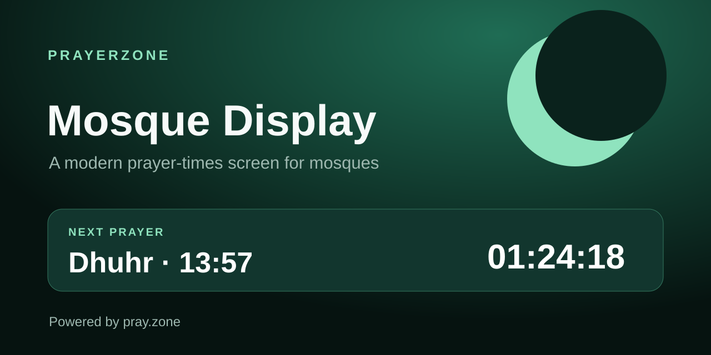

# PrayerZone Mosque Display

[](https://github.com/PrayerZone/prayer-times-mosque-display/actions/workflows/validate.yml)
[](LICENSE)

A modern, installable prayer-times display for mosques, community centres, TVs,
projectors, Raspberry Pi kiosks, and information screens. It uses the public
[PrayerZone API](https://pray.zone/api) and requires no API key.



## Features

- live clock in the prayer location's timezone;
- next-prayer countdown and highlighted schedule;
- city and mosque-specific schedules;
- English, French, Arabic, German, Spanish, Bengali, Italian, and Portuguese API content;
- configurable mosque name, announcements, themes, and seconds;
- persistent device settings and URL-based managed configuration;
- cached prayer schedule when the network is temporarily unavailable;
- installable Progressive Web App;
- responsive layouts for televisions, tablets, and phones;
- keyboard shortcuts: `F` for fullscreen and `S` for settings;
- no runtime dependencies, tracking, advertising, or API credentials.

## Try it

The hosted application will be available at:

```text
https://prayerzone.github.io/prayer-times-mosque-display/
```

For local development:

```bash
npm run dev
```

Open the displayed local URL and select the settings button.

## Managed display URLs

Configure a device without using its settings panel:

```text
?city=paris&lang=en&theme=emerald
?mosque=paris_grande-mosquee-de-paris&lang=fr&theme=midnight
```

Supported query parameters:

| Parameter | Purpose |
|---|---|
| `city` | PrayerZone city slug |
| `mosque` | PrayerZone mosque identifier; takes precedence over `city` |
| `lang` | API language code |
| `theme` | `emerald`, `midnight`, `sand`, or `auto` |
| `name` | Optional custom display heading |

See [Kiosk setup](docs/KIOSK.md) for dedicated display instructions.

## Data and offline behaviour

The display requests today's schedule from:

```text
https://pray.zone/api/public/cities/{city}/prayer-times
https://pray.zone/api/public/mosques/{mosque}/prayer-times
```

It refreshes every 30 minutes and whenever the device reconnects. The latest
successful response is saved locally, so a short network interruption does not
blank the screen. Because prayer schedules change daily, a permanently offline
device still needs a periodic connection.

## Project structure

```text
.
├── assets/             Brand and social-preview assets
├── docs/               Installation guides
├── src/app.js          Browser application
├── src/core.js         Tested scheduling and configuration logic
├── index.html          Accessible application shell
├── styles.css          Responsive themes and display layout
├── manifest.webmanifest
└── sw.js               Offline application-shell cache
```

## Validation

```bash
npm run validate
```

## Official PrayerZone resources

- [PrayerZone](https://pray.zone/)
- [Public API documentation](https://pray.zone/api)
- [OpenAPI contract](https://github.com/PrayerZone/prayer-times-api)
- [Integration examples](https://github.com/PrayerZone/prayer-times-examples)
- [Web Component](https://github.com/PrayerZone/prayer-times-widget)

Localized prayer-time websites are also available in
[French](https://prieres.org/), [German](https://gebet.jetzt/), and
[Spanish](https://oraciones.day/). `pray.zone` remains the canonical project and
developer domain.

## Contributing

Bug fixes, translations, accessibility improvements, new display themes, and
deployment guides are welcome. Read [CONTRIBUTING.md](CONTRIBUTING.md) first.

## License

[MIT](LICENSE)
